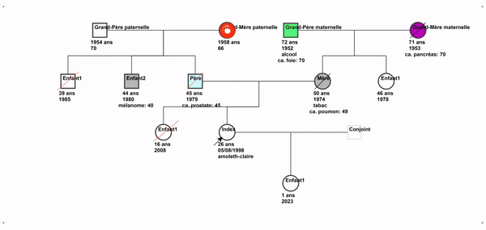
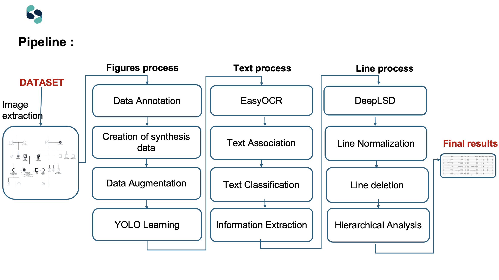

# Data Challenge: Digitalisation des arbres généalogiques pour une prédiction du risque de cancer

## Introduction:

This project focuses on the digitalization of family trees to predict cancer risk. It involves several steps to extract and process information from genealogical data. This work was conducted as part of an ambitious data challenge presented during the event "**Vers une santé connectée : les implications de l’Intelligence Artificielle**" held at Campus 5 in Caen.

The project aims to address a major challenge in genetics and oncology: automating the transcription of medicalized family trees into structured tabular data. This is crucial because clinicians use tools like CanRisk for hereditary cancer risk prediction, which requires data in a tabular format. Manually transcribing a family tree is a time-consuming task, leading to a large amount of unexploited data. Our approach, combining computer vision and artificial intelligence, seeks to make this task faster, more efficient, and systematized, paving the way for personalized risk calculations and more accessible bioinformatics.

Here is a visual representation of the pipeline:

## Methodology

The complex problem was broken down into three manageable computational problems: form recognition, text extraction (OCR and classification), and line detection and utilization to create a graph structure.

The methodology encompasses the following key stages, as depicted in the pipeline below:

1.  **Data Annotation:** Initial step involving the annotation of relevant data points within the family tree images.
2.  **Creation of synthesis data:** Generation of synthetic data to augment the existing dataset and improve model robustness.
3.  **Data Augmentation:** Techniques applied to increase the diversity of the training data.
4.  **YOLO Learning:** Utilizing YOLO (You Only Look Once) for object detection, specifically to identify individuals within the family tree.
5.  **EasyOCR:** Implementation of EasyOCR for optical character recognition, extracting textual information from the images.
6.  **Text Association:** Linking the extracted text to the corresponding individuals or elements in the family tree.
7.  **Text Classification:** Categorizing and labeling the extracted text (e.g., names, dates, medical conditions).
8.  **Information Extraction:** Pulling out key details and relationships from the processed text.
9.  **DeepLSD:** Employing DeepLSD for line segment detection, crucial for interpreting the structure of the family tree.
10. **Line Normalization:** Standardizing the detected lines for consistent processing.
11. **Line Deletion:** Removing irrelevant or extraneous lines.
12. **Hierarchical Analysis:** Analyzing the structure and relationships within the family tree.
13. **Image extraction**: extracting individuals.

## Future Work and Contributions

This project is an ongoing effort, and there is still significant work to be done to refine and expand its capabilities. We warmly welcome contributions from the community to help improve any aspect of the pipeline. We are also open to sharing the trained weights for the YOLO model upon request to facilitate further research and development. All suggestions and feedback are highly appreciated. Please feel free to open a GitHub issue to communicate with us regarding any potential contributions, suggestions, or questions.

This project highlights the collaboration between researchers, healthcare professionals, and engineers to envision a more connected medicine. We would like to thank the Centre François Baclesse for its commitment to innovation and the University of Caen Normandie for providing the opportunity to contribute to this project.

For more details on the context of this data challenge, you can refer to the following LinkedIn post: [https://www.linkedin.com/posts/romain-andres-6b551b203_santaez-ia-datachallenge-activity-7268295204468572160-7Lp_?utm_source=share&utm_medium=member_desktop&rcm=ACoAADPeSykBw-8U0O9X6Km4RLjQXMRTeY_oPwE](https://www.linkedin.com/posts/romain-andres-6b551b203_santaez-ia-datachallenge-activity-7268295204468572160-7Lp_?utm_source=share&utm_medium=member_desktop&rcm=ACoAADPeSykBw-8U0O9X6Km4RLjQXMRTeY_oPwE)

## First inspirations : 
Conte, L.; Rizzo, E.; Grassi, T.; Bagordo, F.; De Matteis, E.; De Nunzio, G. Artificial Intelligence Techniques and Pedigree Charts in Oncogenetics: Towards an Experimental Multioutput Software System for Digitization and Risk Prediction. Computation 2024, 12, 47. https://doi.org/10.3390/computation12030047

## Citation

If you use this code or methodology in your research or projects, please cite the GitHub repository. You can use the following format:

Andres, R., Orou-Guidou, A. F., Jajour, I. (2024). *GeneticPedigreeChartToPed*. Available at: [[https://github.com/VendenIX/GeneticPedigreeChartToPed](https://github.com/VendenIX/GeneticPedigreeChartToPed)]

## Authors:

* Romain Andres
* Amirath Fara Orou-Guidou
* Imane Jajour

## Supervisors:

* Laurent Castera
* Camille Aucouturier
* Aurélien Corroyer-Dulmont